# Agent Team Overview

MCP-B includes a specialized team of AI agents designed for ML/AI pipeline tasks. Each agent has specific capabilities, tools, and instructions.

## Team Structure

```mermaid
graph LR
    DC[🔬 Data Collector] --> DP[🧹 Data Prep]
    DP --> MT[🤖 Model Trainer]
    MT --> RA[📊 Results Analyst]
    RA --> VZ[🎨 Visualization]
    VZ --> PB[📝 Publisher]
```



## Agents

| Agent | Emoji | Role |
|-------|-------|------|
| [Data Collector](data-collector.md) | 🔬 | Gather and ingest data |
| [Data Prep](data-prep.md) | 🧹 | Clean and transform data |
| [Model Trainer](model-trainer.md) | 🤖 | Train and optimize models |
| [Results Analyst](results-analyst.md) | 📊 | Analyze performance |
| [Visualization](visualization.md) | 🎨 | Create charts and graphs |
| [Publisher](publisher.md) | 📝 | Generate docs and deploy |

## Workflow Patterns

### ML Pipeline (Full)

```yaml
agents:
  - data_collector
  - data_prep
  - model_trainer
  - results_analyst
  - visualization
  - publisher
```

### Quick Analysis

```yaml
agents:
  - data_collector
  - results_analyst
  - visualization
```

### Model Iteration

```yaml
agents:
  - model_trainer
  - results_analyst
  - visualization
```

## MCP Server Integration

All agents can leverage:

- **#serena** - Semantic code analysis
- **#context7** - Documentation lookups

## Usage with Copilot

When using GitHub Copilot:

1. Reference the agent role in your prompt
2. Use `#serena` for code analysis
3. Use `#context7` for documentation
4. Follow the specialized instructions

Example:
```
@copilot As the Data Prep Agent, clean this dataset using #serena for code analysis
```
