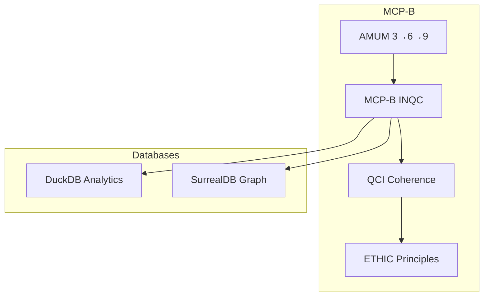

# MCP-B Documentation

Welcome to the MCP-B (Master Client Bridge) documentation.

## Overview

MCP-B is a complete agent communication framework combining:

- **MCP-B Protocol**: 4-layer encoding for agent-to-agent messaging
- **AMUM**: Progressive 3→6→9 human-AI alignment workflow
- **QCI**: Quantum coherence state tracking
- **ETHIC**: AI ethics principles enforcement

## Quick Links

- [Installation](getting-started/installation.md)
- [Quick Start](getting-started/quickstart.md)
- [Agent Team Overview](agents/overview.md)
- [API Reference](api/index.md)

## Architecture

## Agent Team

MCP-B includes specialized AI agents for ML/AI pipelines:

| Agent | Role | Emoji |
|-------|------|-------|
| Data Collector | Gather data from sources | 🔬 |
| Data Prep | Clean and transform data | 🧹 |
| Model Trainer | Train and optimize models | 🤖 |
| Results Analyst | Analyze performance | 📊 |
| Visualization | Create charts and graphs | 🎨 |
| Publisher | Generate docs and deploy | 📝 |

## MCP Servers

This project is configured to use:

- **Serena**: Semantic code analysis with symbol-level understanding
- **Context7**: Up-to-date documentation and API context

See [copilot instructions](https://github.com/bjoernbethge/mcp-b/blob/main/.github/copilot-instructions.md) for usage details.

## License

MIT License - Björn Bethge
